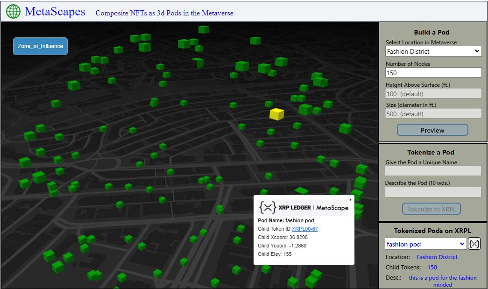
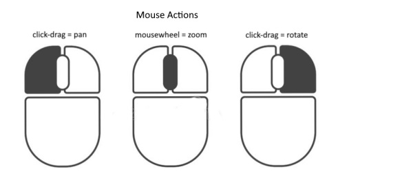

Table of Contents
1.  [What Is MetaScapes](#what-is-metascapes)
2.  [What Is a Composite NFT](#what-is-a-composite-nft)
3.  [Getting Started](#getting-started)
4.  [How MetaScapes Works](#how-metascapes-works)
5.  [Navigating the UI](#navigating-the-ui)
6.  [Next Steps](#next-steps)
7.  [Built With](#built-with)
8.  [Contact](#contact)

What Is MetaScapes
-----------------
_**MetaScapes**_ is a prototype concept that explores the idea of bringing composite geo-located NFTs minted on the XRP Ledger into a typical metaverse environment.  Through a browser based viewer these NFTs can be interactively created and visually positioned above the surface at specific locations within a metaverse scene.  Serving as an alternative to owning virtual plots of land in a metaverse, a user can create a 3d pod of any size and altitude consisting of multiple tokenized nodes (NFTs) which collectively define the shape and behavior of the pod.  Each node (token) in the 3d pod has a unique x,y,z location attribute and is a member of the composite NFT that describes the pod as a whole.

View the web application here: https://master.dxvmqmj9eoihk.amplifyapp.com/

What Is a Composite NFT
-------------------------
_**MetaScapes**_ uses geo-located composite NFTs to visually represent three dimensional shapes (pods) in the metaverse. Being geo-located simply means that each NFT has location geometry associated with it.  A composite NFT can be thought of as a parent token having mulitple related child tokens.  The metadata that describes each child token is stored in the parent token.  With this model, the parent token can represent the group of tokens as a whole (3d pod) and have control over any updates or transactions occurring on the XRP Ledger.  To assure interoperability between metaverse environments, accepted metadata standards are adhered to.  Composite NFTs are analogous to an NFT ecosystem or community.

Getting Started
---------------
The _**MetaScapes**_ application has been deployed on AWS as a web service available to all. No installation or configuration is required. This web service application serves as a demo and is designed to be a 'sandbox' that can be used to demonstrate the functionality of MetaScapes.

*   Supported Browsers:
    *   Chrome
    *   Brave
    *   FireFox
    *   Edge
    *   Not formatted for mobile phones

How MetaScapes Works
--------------------
The project demo is built using React.js and consists of three main components including Mapbox 3d Viewer, XRPL.js, and Ceramic Network.  The application user is presented with a visual interface that allows them to build and view 3d pods (composite NFTs on XRPL testnet) in a metaverse environment.  The steps are as follows:

**Default View**
   1.	On loading, the user will see a blank metaverse.  Click on ‘Preview’ to display the default pod.  A pod is generated in Avatar Park & Ride having 250 nodes.  Use       the mouse controls to move and rotate the display to see its shape.
   2.	Click ‘Zone_of_Influence’ in the upper left corner.  This displays an area defined by the pod parameters (location, nodes, height, size).  All nodes in any pod         will always be contained within this area.  Click again to remove the graphic.
   3.	Zoom in a little and ‘left mouse click’ on a node in the pod.  Notice it turns yellow and a popup displays the location details of the node.
   
**Build a Pod**
   1.	Using the pod builder tools, try previewing several combinations of metaverse location and number of nodes.  Note: for this demo, three locations are predefined.       A tool for user defined addresses can easily be added.  Also, the maximum number of nodes has been set to 500.
   2.	By default, the height of any pod above the surface is set to 100 ft. and the diameter is set to 200 ft.  These parameters could be dynamic.  A pod could               actually be just a few feet across.
   3.	The pods being created are generated randomly using an algorithm that uses the location, height, and size parameters.  Pods could also be generated from external       sources such as point cloud files or digital twins.
   
**Tokenize a Pod**
   1.	Once a pod is built and previewed, it can then be tokenized into a composite NFT on the XRP Ledger.  Click the ‘Tokenize to XRPL’ button to start the process.          Note: currently there is a 150 node limit in any  pod being created.  Once a name and description are entered, the tokenization process will start.
   2.	Note the progress indicator which displays the number of tokenized nodes in the pod.
   3.	Upon completion, the newly minted composite NFT pod can be viewed by selecting its name in the ‘Tokenized Pods on XRPL’ dropdown list.  The pod will be green.
   4.	Each node (child token) in the pod is now an NFT on the XRP Ledger.  Zoom in a little and ‘left mouse click’ on a token in the pod.  Notice it turns yellow and a       popup displays the metadata of the child token and references the pod name (master token).  There is a link to the child tokenID in XRPL Explorer.
   5.	The composite NFT (or master token) can be viewed in XRPL Explorer by clicking the button to the right of ‘Tokenized Pods on XRPL’ dropdown list.  This passes         the master tokenID to XRPL Explorer.  In Explorer, notice the URI of the NFT.  This is the link to the metadata for the master and all child tokens stored in a         Ceramic decentralized database.

**View Tokenized Pods**
   1.	To view any previously tokenized pods, select a pod name from the ‘Tokenized Pods on XRPL’ dropdown list.

Navigating the UI
-----------------

To interactively maneuver the 3d metaverse viewer refer to the above diagram.
 
Next Steps
-------
This  project is really just a starting point for exploring the possibilities of composite NFTs in the metaverse.  Additional tools can be built that extend MetaScapes providing capabilities yet to be developed.  Here are some ideas:
   *	The  location of individual child tokens can be moved or ownership can be transferred
   *	The location of an entire pod can be moved or ownership transferred
   *	Child tokens can be added or deleted from the master pod
   *	Child tokens can be animated in real time
   *	Digital twin data sources can become 3d pods
   *	Using hooks, composite NFTs can receive external data via oracles and emit a response
   *	Composite NFT pods can be created at a micro scale which when combined with AI could provide new ways to use the metaverse.

Built With
----------
*   [React](https://reactjs.org/) – JavaScript library for building user interfaces
*   [Mapbox GL JS](https://mapbox.com/) – JavaScript library for building 3d web maps
*   [xrpl.js](https://xrpl.org/) - Javascript library for integrating dapps with the XRP Ledger,
*   XRP Ledger([https://testnet.xrpl.org](https://testnet.xrpl.org/) - testnet)
*   [Ceramic Network](https://ceramic.network/ :ceramic-clay testnet) - a decentralized data network for Web3 applications
*   [Node.js](https://nodejs.org/en/) - a cross-platform JavaScript runtime environment

Contact
-------
Scott Randolph - [blocklagoon@gmail.com](mailto:blocklagoon@gmail.com)

LinkedIn - [https://www.linkedin.com/in/scott-randolph-2a4948236/](https://www.linkedin.com/in/scott-randolph-2a4948236/)
